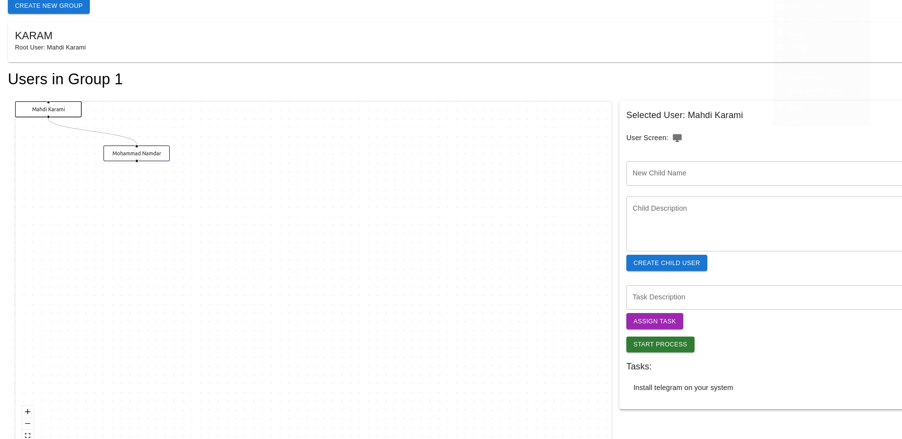
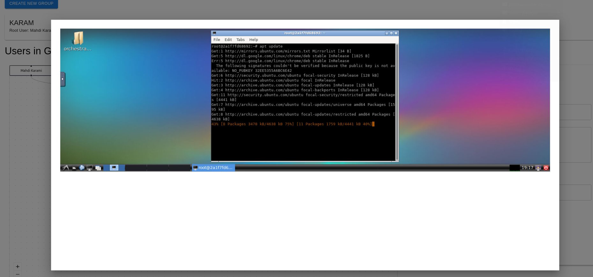

# Orchestrator Project

The **Orchestrator Project** is a backend system designed to automate tasks on remote Ubuntu desktops using GUI interactions (e.g., clicking, typing) and shell commands. It integrates with Docker containers running Ubuntu VNC desktops and leverages AI models to perform tasks dynamically.

This project also has a **frontend** that allows users to interact with the system, manage tasks, and monitor the status of automated processes.

---

## Project Proposal
This project aims to simulate a team of individuals working together to accomplish complex tasks. Each user in the system is provided with a dedicated desktop environment where they can perform their tasks.

### Key Features:
1. User Hierarchy:

   - Each user can create and manage multiple subordinates.
   - Tasks can be delegated to subordinates for efficient task distribution.

2. Task Automation:

    - When a task is assigned, the system uses vision models to determine if the user can perform the task on their own.

    - If the task is too complex, the system breaks it down into smaller subtasks and assigns them to specialized subordinates.

3. Dynamic Task Allocation:

    - The system identifies the required expertise for each subtask and "hires" (simulates) the appropriate specialist to complete it.

    - This ensures that tasks are completed efficiently, even if the original user lacks the necessary skills.

4. Desktop Environments:

    - Each user has access to a dedicated desktop environment (via Docker containers with Ubuntu VNC desktops).

    - This allows users to perform GUI-based tasks, run commands, and manage their workflows seamlessly.

### Use Case Example:
- A user is assigned the task of "Installing and Configuring a Web Server."

- The system analyzes the task and determines that it requires expertise in:
  1. Installing software (e.g., apt-get install).
  2. Configuring network settings.
  3. Setting up firewall rules.

- The system then delegates these subtasks to specialized subordinates, ensuring the task is completed efficiently.


## Features

- **Automated GUI Interactions**: Perform clicks, typing, and other GUI actions on remote Ubuntu desktops.
- **Task Management**: Create, assign, and execute tasks for users and their subordinates.
- **AI-Powered Automation**: Use AI models to determine the best actions to complete tasks.
- **Docker Integration**: Run tasks in isolated Docker containers with Ubuntu VNC desktops.
- **Frontend Integration**: Connect to a frontend application for a user-friendly interface.

---

## Technologies Used

This project is built using the following technologies and libraries:

### Core Technologies
- **Python**: The primary programming language for the backend.
- **SQLAlchemy**: For database management and ORM.
- **Docker**: To create and manage isolated environments for tasks.
- **VNC**: For remote desktop access and GUI interactions.

### AI and Automation
- **[Open Computer Use](https://github.com/e2b-dev/open-computer-use)**: A library for automating computer tasks using AI models. It provides tools for GUI interactions, command execution, and task automation.
- **[Docker Ubuntu VNC Desktop](https://github.com/fcwu/docker-ubuntu-vnc-desktop/)**: A Docker image that provides a Ubuntu desktop environment with VNC support. This is used to create isolated environments for each user.

### Frontend
- The project has a **frontend** built with modern web technologies (e.g., React, Vue.js, or Angular) that connects to this backend via APIs. The frontend allows users to:
  - Create and manage tasks.
  - Monitor the status of automated processes.
  - View logs and results of executed tasks.

---

## How It Works

1. **Task Creation**:
   - Users create tasks (e.g., "Install Telegram") through the frontend or API.
   - Tasks are assigned to specific users or subordinates.

2. **Task Execution**:
   - The backend uses AI models to determine the best actions to complete the task (e.g., clicking on the terminal icon, typing commands).
   - Actions are executed in the user's Docker container using VNC and shell commands.

3. **Frontend Integration**:
   - The frontend displays the status of tasks and provides a user-friendly interface for managing them.
   - Users can view logs, screenshots, and results of executed tasks.

---

## Setup and Installation

### Prerequisites
- Docker installed on your system.
- Python 3.8 or higher.
- A VNC client (optional, for debugging).

### Steps

1. **Clone the Repository**:
   ```bash
   git clone https://github.com/mkdir98/orchestrator.git
   cd orchestrator-project
   ```

2. **Set Up libraries**:
   - Install libs:
     ```bash
     poetry install
     ```

3. **Configure the Backend**:
   - create `.env` file for put api keys of models
   - Update the `config_service.py` file with your Docker and VNC settings.

4. **Run the Backend**:
   ```bash
   poetry run flask
   ```

5. **Connect the Frontend**:
   - Clone the [frontend repository and follow its setup instructions.
   - Configure the frontend to connect to the backend API.

---

## Usage

### Creating a Task
1. Use the frontend or API to create a task.

2. The backend will automatically execute the task in the user's Docker container.


### Monitoring Tasks
- Use the frontend to view the status of tasks, logs, and results.

---

