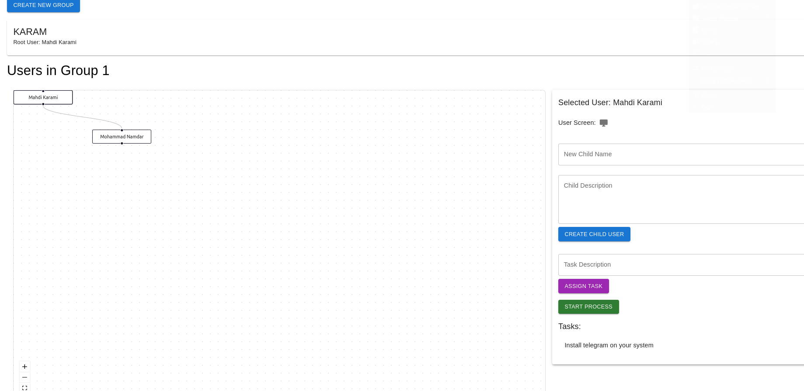
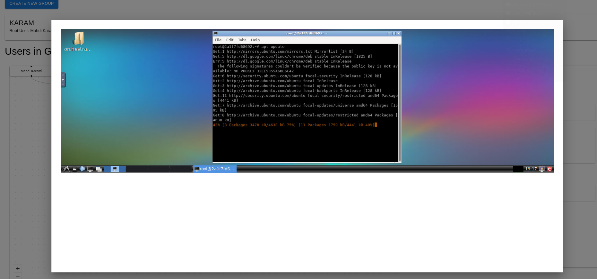
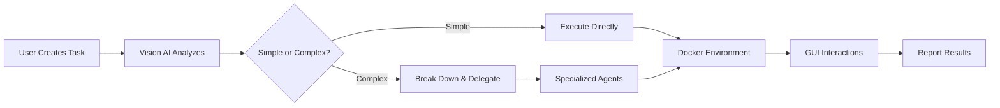

# Orchestrator

> AI-Powered Multi-Agent Task Automation System with Vision Intelligence

[](https://opensource.org/licenses/MIT)
[](https://www.python.org/downloads/)

Orchestrator is an intelligent automation platform that uses Vision AI to execute complex tasks through a hierarchical multi-agent system. Each agent operates in an isolated Docker environment with GUI interaction capabilities, enabling autonomous task completion with human-like precision.

---

## Overview

Orchestrator revolutionizes task automation by combining:

- **Vision AI**: Advanced computer vision models that understand and interact with GUI elements
- **Multi-Agent Architecture**: Hierarchical system where agents can delegate tasks to specialized subordinates
- **Autonomous Execution**: Agents independently complete tasks by analyzing screenshots and taking actions (clicks, typing, commands)
- **Inter-Agent Communication**: Agents collaborate through integrated messaging (RocketChat)
- **Isolated Environments**: Each agent operates in a dedicated Docker container with Ubuntu VNC desktop

### Core Concept

Think of Orchestrator as simulating a team of specialists working together. When assigned a complex task, the system:

1. Analyzes the task using Vision AI
2. Determines if it needs specialized skills
3. Delegates subtasks to appropriate subordinate agents
4. Coordinates execution across multiple agents
5. Aggregates results and reports completion

---

## Key Features

### Automated GUI Interactions
- Click, type, scroll, and navigate through any GUI application
- Vision-based element detection and interaction
- OCR support for text extraction
- Screenshot-based decision making

### Hierarchical Agent System
- Manager-subordinate relationships
- Dynamic task delegation
- Specialized agent creation on-demand
- Role-based access and capabilities

### Inter-Agent Communication
- Integrated RocketChat messaging
- Agents can communicate with managers and peers
- Automated introductions and status updates
- Task coordination through chat

### Docker-Based Isolation
- Each agent runs in its own Ubuntu VNC desktop
- Complete isolation for security and stability
- Reproducible environments
- Easy scaling and management

### Intelligence & Learning
- Memory system for past actions
- Shared learning across agents
- RAG (Retrieval-Augmented Generation) for knowledge base
- Element memory for efficient UI interaction

### Reliability & Fallbacks
- Multiple Vision AI providers (automatic fallback)
- Error detection and recovery
- Action verification
- Detailed logging and monitoring

---

## Current Capabilities

### Task Automation
The system can autonomously execute tasks such as:
- Software installation and configuration
- Web navigation and form filling
- File management and organization
- Command-line operations
- GUI application interactions

### Agent Communication
Agents are fully capable of:
- **Logging in** to the RocketChat messaging system
- **Finding their manager** in the user hierarchy
- **Introducing themselves** as subordinates
- **Exchanging messages** with other agents
- **Coordinating tasks** through chat communication

**Example Workflow**: When a new agent is created, it automatically:
1. Opens the RocketChat web interface
2. Logs in with its credentials
3. Searches for its manager agent
4. Sends an introduction message
5. Awaits further instructions

### Vision AI Integration
- Automatic model selection and fallback
- Support for multiple AI providers (g4f integration)
- Image analysis and element detection
- Adaptive to different screen resolutions

---

## Screenshots

### Task Creation Interface

*Create and assign tasks to agents through the web interface*

### Task Execution & Results

*Real-time monitoring of agent actions with screenshots and logs*

---

## How It Works


```mermaid
graph LR
    A[User Creates Task] --> B[Vision AI Analyzes]
    B --> C{Simple or Complex?}
    C -->|Simple| D[Execute Directly]
    C -->|Complex| E[Break Down & Delegate]
    E --> F[Specialized Agents]
    D --> G[Docker Environment]
    F --> G
    G --> H[GUI Interactions]
    H --> I[Report Results]
```

1. **Task Creation**: User defines a task through the frontend or API
2. **Analysis**: Vision AI examines the task and current screen state
3. **Execution Strategy**: System decides whether to execute directly or delegate
4. **Action Loop**: Agent takes actions (click, type, etc.) based on vision analysis
5. **Result Reporting**: Screenshots, logs, and status updates sent back to user

---

## Architecture

### System Components

```
┌─────────────────────────────────────────────────────────────┐
│                         Frontend (React)                     │
│                   Task Management & Monitoring               │
└─────────────────────┬───────────────────────────────────────┘
                      │ REST API / WebSocket
┌─────────────────────▼───────────────────────────────────────┐
│                  Backend (Python/Flask)                      │
│  ┌──────────────┬──────────────┬──────────────────────────┐ │
│  │ Task Service │ User Service │ Processor Service        │ │
│  ├──────────────┼──────────────┼──────────────────────────┤ │
│  │ Vision AI    │ Memory/RAG   │ Container Orchestration  │ │
│  └──────────────┴──────────────┴──────────────────────────┘ │
└─────────────────────┬───────────────────────────────────────┘
                      │
        ┌─────────────┼─────────────┐
        │             │             │
┌───────▼──────┐ ┌───▼─────┐ ┌────▼───────┐
│ Docker Agent │ │ Docker  │ │ RocketChat │
│   Container  │ │ Agent   │ │ Messaging  │
│ Ubuntu VNC   │ │ ...     │ │  System    │
└──────────────┘ └─────────┘ └────────────┘
```

### Technology Stack

**Backend**
- Python 3.10+
- Flask (web framework)
- SQLAlchemy (ORM)
- APScheduler (task scheduling)
- Flask-SocketIO (real-time communication)

**AI & Vision**
- g4f (AI model integration)
- OpenAI / Anthropic (optional)
- Computer vision models
- OCR (Tesseract)

**Infrastructure**
- Docker (containerization)
- Ubuntu VNC Desktop containers
- RocketChat (messaging)
- PostgreSQL/SQLite (database)

**Frontend**
- React
- WebSocket for real-time updates
- Modern UI components

---

## Use Cases

### QA & Automated Testing
- Automated UI/UX testing across browsers
- Regression testing
- Visual verification
- Test case execution

### Robotic Process Automation (RPA)
- Business process automation
- Repetitive task elimination
- Legacy system integration
- Data migration

### DevOps Automation
- Server configuration and setup
- Software deployment
- System monitoring
- Infrastructure management

### Customer Support
- Ticket triage and routing
- Automated responses
- Issue reproduction
- Knowledge base updates

### Data Entry & Processing
- Form filling automation
- Data extraction from images
- Document processing
- Report generation

---

## Roadmap

### Completed

- Basic task execution with Vision AI
- GUI interaction (click, type, scroll, etc.)
- Docker environment management
- Agent-to-agent messaging via RocketChat
- Hierarchical user/agent system
- Frontend task management interface
- Memory and learning systems (basic)
- Multiple AI provider support with fallbacks

### In Progress

- Advanced agent understanding and natural language processing
- Enhanced inter-agent communication protocols
- Complex task breakdown and intelligent delegation
- Improved error handling and recovery

### Future Plans

- Multi-agent collaboration on complex tasks
- Advanced learning and memory systems
- Performance optimization and caching
- Enterprise features (SSO, RBAC, audit logs)
- Plugin system for custom actions
- Mobile device support (Android/iOS emulation)
- Advanced analytics and reporting
- Marketplace for pre-built task templates

---

## Installation & Setup

### Prerequisites

- **Docker**: Version 20.10 or higher
- **Python**: Version 3.10 or higher
- **Poetry**: For dependency management
- **RocketChat** (optional): For agent communication features

### Step 1: Clone the Repository

```bash
git clone https://github.com/mkdir98/orchestrator.git
cd orchestrator
```

### Step 2: Install Dependencies

```bash
# Install Poetry if not already installed
curl -sSL https://install.python-poetry.org | python3 -

# Install project dependencies
poetry install
```

### Step 3: Configure Environment

Create a `.env` file in the project root:

```bash
# AI Provider API Keys (optional - uses free providers by default)
OPENAI_API_KEY=your_openai_key_here
ANTHROPIC_API_KEY=your_anthropic_key_here

# JWT Secret for authentication
JWT_SECRET_KEY=your_random_secret_key

# RocketChat Configuration (for agent communication)
ROCKET_CHAT_ADDRESS=http://localhost:3000
ROCKET_CHAT_AUTH_TOKEN=your_auth_token
ROCKET_CHAT_USER_ID=your_user_id
ROCKET_CHAT_ADMIN_NAME=admin
ROCKET_CHAT_ADMIN_USER_ID=admin_id

# Ollama Configuration (optional - for local models)
OLLAMA_BASE_URL=http://localhost:11434

# Database Configuration
DATABASE_URL=sqlite:///orchestrator_data/local/orchestrator.db
```

### Step 4: Initialize Database

```bash
# Run database migrations
poetry run alembic upgrade head
```

### Step 5: Start the Backend

```bash
poetry run flask
```

The backend will start on `http://localhost:5000`

### Step 6: Setup Frontend

```bash
cd ../orchestrator-frontend
npm install
npm start
```

The frontend will start on `http://localhost:3000`

### Step 7: Setup RocketChat (Optional)

For agent communication features:

```bash
# Using Docker Compose
docker-compose up -d rocketchat
```

Configure RocketChat at `http://localhost:3000` and update `.env` with credentials.

---

## Configuration

### Environment Variables

| Variable | Description | Default |
|----------|-------------|---------|
| `JWT_SECRET_KEY` | Secret key for JWT authentication | Required |
| `OPENAI_API_KEY` | OpenAI API key (optional) | None |
| `ANTHROPIC_API_KEY` | Anthropic API key (optional) | None |
| `ROCKET_CHAT_ADDRESS` | RocketChat server URL | `http://localhost:3000` |
| `DATABASE_URL` | Database connection string | SQLite |
| `OLLAMA_BASE_URL` | Ollama server URL | `http://localhost:11434` |

### Docker Configuration

Each agent runs in an isolated Docker container. Configuration options in `services/config_service.py`:

- Container image: `dorowu/ubuntu-desktop-lxde-vnc`
- Screen resolution: Configurable per agent
- Resource limits: CPU, memory allocation
- Network isolation: Optional

### Model Selection

Configure AI models in `orchestrator/services/llm_provider.py`:

```python
# Default fallback models (fast and reliable)
FALLBACK_MODELS = [
    {'model': '', 'provider': WhiteRabbitNeo, 'name': 'WhiteRabbitNeo'},
    {'model': '', 'provider': Startnest, 'name': 'Startnest'},
    {'model': 'openai', 'provider': PollinationsAI, 'name': 'PollinationsAI'},
]
```

---

## Quick Start

### Creating Your First Task

#### Via Frontend:
1. Navigate to `http://localhost:3000`
2. Create a new agent or select existing one
3. Click "Create Task"
4. Enter task description (e.g., "Open Firefox and navigate to google.com")
5. Monitor execution in real-time

#### Via API:

```python
import requests

# Create a task
response = requests.post('http://localhost:5000/api/tasks', 
    json={
        'user_id': 1,
        'description': 'Open terminal and run "ls -la"'
    },
    headers={'Authorization': 'Bearer YOUR_JWT_TOKEN'}
)

task_id = response.json()['task_id']

# Monitor task status
status = requests.get(f'http://localhost:5000/api/tasks/{task_id}',
    headers={'Authorization': 'Bearer YOUR_JWT_TOKEN'}
)
```

### API Endpoints

| Method | Endpoint | Description |
|--------|----------|-------------|
| POST | `/api/auth/login` | User authentication |
| POST | `/api/auth/register` | Register new user |
| GET | `/api/users` | List all agents |
| POST | `/api/users` | Create new agent |
| GET | `/api/tasks` | List tasks |
| POST | `/api/tasks` | Create new task |
| GET | `/api/tasks/{id}` | Get task details |
| GET | `/api/groups` | List agent groups |

---

## Project Structure

```
orchestrator/
├── orchestrator/              # Main backend code
│   ├── __init__.py
│   ├── app.py                # Flask application entry point
│   ├── agent.py              # Agent implementation
│   ├── models/               # Database models
│   │   ├── user.py          # Agent/user model
│   │   ├── task.py          # Task model
│   │   ├── message.py       # Message model
│   │   └── memory.py        # Memory model
│   ├── services/             # Core services
│   │   ├── processor_service.py    # Task execution
│   │   ├── llm_provider.py        # AI model integration
│   │   ├── container_service.py   # Docker management
│   │   ├── chat_service.py        # RocketChat integration
│   │   ├── user_service.py        # User/agent management
│   │   ├── task_service.py        # Task management
│   │   ├── rag_service.py         # Knowledge base
│   │   └── websocket_service.py   # Real-time communication
│   └── tests/                # Test suites
├── migrations/               # Database migrations
├── docs/                     # Documentation and screenshots
├── models/                   # Pre-trained ML models
├── orchestrator_data/        # Runtime data and logs
├── pyproject.toml           # Poetry dependencies
├── README.md                # This file
└── LISENCE                  # MIT License
```

---

## Testing

### Running Tests

```bash
# Run all tests
poetry run pytest

# Run specific test
poetry run pytest orchestrator/tests/ProcessorServiceTest.py

# Run with coverage
poetry run pytest --cov=orchestrator
```

### Vision Model Testing

Test Vision AI capabilities:

```bash
# Quick test (sequential, stable)
python test_vision_simple.py

# Comprehensive test (parallel)
python test_vision_framework.py

# Test with specific providers
python test_with_packages.py
```

---

## Contributing

We welcome contributions! Here's how you can help:

### Getting Started

1. Fork the repository
2. Create a feature branch (`git checkout -b feature/amazing-feature`)
3. Commit your changes (`git commit -m 'Add amazing feature'`)
4. Push to the branch (`git push origin feature/amazing-feature`)
5. Open a Pull Request

### Code Style

- Follow PEP 8 for Python code
- Use type hints where possible
- Write docstrings for functions and classes
- Add tests for new features

### Reporting Issues

Found a bug? Have a feature request? Please open an issue on GitHub with:

- Clear description of the problem/feature
- Steps to reproduce (for bugs)
- Expected vs actual behavior
- Screenshots if applicable
- Environment details (OS, Python version, Docker version)

---

## License

This project is licensed under the MIT License - see the [LISENCE](LISENCE) file for details.

```
MIT License

Copyright (c) 2025 Mahdi Karami

Permission is hereby granted, free of charge, to any person obtaining a copy
of this software and associated documentation files (the "Software"), to deal
in the Software without restriction, including without limitation the rights
to use, copy, modify, merge, publish, distribute, sublicense, and/or sell
copies of the Software, and to permit persons to whom the Software is
furnished to do so, subject to the following conditions:

The above copyright notice and this permission notice shall be included in all
copies or substantial portions of the Software.
```

---

## Acknowledgments

This project builds upon several excellent open-source projects:

- [g4f](https://github.com/xtekky/gpt4free) - Free AI model access
- [Docker Ubuntu VNC Desktop](https://github.com/fcwu/docker-ubuntu-vnc-desktop) - VNC desktop containers
- [RocketChat](https://rocket.chat/) - Open-source messaging platform
- [Open Computer Use](https://github.com/e2b-dev/open-computer-use) - Computer automation inspiration

---

## Contact & Support

- **GitHub Issues**: [Report bugs or request features](https://github.com/mkdir98/orchestrator/issues)
- **Discussions**: [Join the conversation](https://github.com/mkdir98/orchestrator/discussions)
- **Author**: Mahdi Karami

---

## Research & Citations

If you use Orchestrator in your research, please cite:

```bibtex
@software{orchestrator2025,
  title = {Orchestrator: AI-Powered Multi-Agent Task Automation System},
  author = {Karami, Mahdi},
  year = {2025},
  url = {https://github.com/mkdir98/orchestrator}
}
```

---

<div align="center">
  
**Built with care by [Mahdi Karami](https://github.com/mkdir98)**

Star us on GitHub if you find this project useful!

[Report Bug](https://github.com/mkdir98/orchestrator/issues) · [Request Feature](https://github.com/mkdir98/orchestrator/issues) · [Documentation](https://github.com/mkdir98/orchestrator/wiki)

</div>
